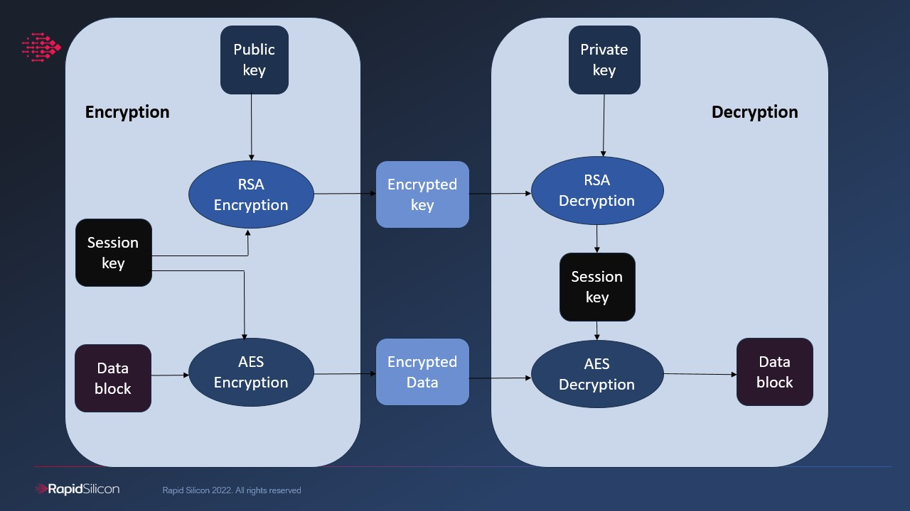

# Introduction

This tool provides `ieee1735` encryption of verilog. The chosen approach uses a pair of RSA public/private keys for encryption/decryption. Block diagram of ieee1735 standard is given below.




It shows both encryption and decryption processes. Steps in encryption are:

* Marking up the IP lightly to describe:​
    * The aspects to be protected​
    * What remains visible​
    * Which tools can be used​
    * Rights of the IP user
* Generation of random session key
* Encryption of session key using RSA public key
* AES encryption of data block

While decryption process is as following:

* Extraction of session key from `Encrypted key` using RSA private key
* AES decryption of `Encrypted Data` using the session key

# Directory structure

```bash
├── CMakeLists.txt
├── img
│   └── ieee1735.jpg
├── install_dependencies.sh
├── library
│   ├── embedded_key.v
│   └── simple_rtl.v
├── README.md
└── src
    ├── ieee_1735.cpp
    ├── ieee1735_encrypt_verilog.cpp
    └── ieee_1735.h
```

## CMakeLists.txt
* Comiles the source code

## img
* Contains block diagram of ieee1735

## install_dependencies.sh
* This script can be run to install dependencies

## example_library
It contains two files:

*  `simple_rtl` contains simple verilog without any marking for protection

* `embedded_key.v` has been marked up for protection. It contains some additional information like author name, author information, key name, method for key encryption, method for data encryption etc.
    * RSA public key is given under `pragma protect key_public_key`
    * Data to be encrypted is written under `pragma protect`

Note: See these two files for marking up your own RTL files

## src
* It contains source code for encryption

# How to run

## Cloning submodules
```
git submodule update --init --recursive
```

## Generating build files

In `arch_library_tools/encrypt_verilog`

``` 
cmake -b . -s .
```

## Make targets

**TO generate EXE, run:**
```
make
```

**To delete all build files and generated encrypted files, run:**

```
make clean_all
```

## Generating encrypted files

```
./encrypt_verilog <inFile.v> <outFile.v>
```